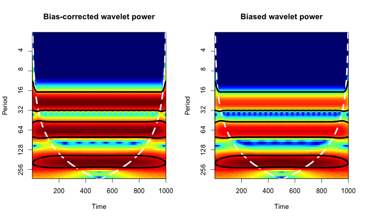
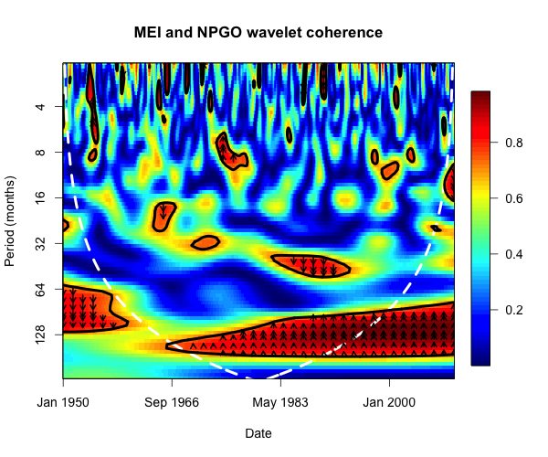

# biwavelet R package

[](http://cran.r-project.org/package=biwavelet)
[](https://travis-ci.org/vsimko/biwavelet)
[](https://codecov.io/github/vsimko/biwavelet?branch=master)


## Download and Install

To download the development version of the package, type the following at the R command line:
```{r}
install.packages("devtools")
devtools:::install_github("tgouhier/biwavelet")
```

To download the release version of the package on CRAN, type the following at the R command line:
```{r}
install.packages("biwavelet")
```

## About biwavelet
The biwavelet R package is a port of the WTC MATLAB program written by Aslak Grinsted and the wavelet
program written by Christopher Torrence and Gibert P. Compo. This package can be used to perform
univariate and bivariate wavelet analyses. Wavelet analyses are resolved in the time and frequency
domains, and thus ideal for identifying changes over time in the contribution of each frequency
(or period) of a time series.

Since version 0.14, biwavelet also plots the **bias-corrected wavelet** and **cross-wavelet power spectrum**
using the methods described by [Liu et al. (2007)](#Liu2007) and [Veleda et al. (2012)](#Veleda2012).
This correction is needed because the traditional approach for computing the power spectrum
(e.g., [Torrence and Compo 1998](#TorrenceCompo1998)) leads to an artificial and systematic
reduction in power at lower periods. To demonstrate this bias, we can construct a time series
by summing three sinusoidal waves each characterized by the same power at a different period:

```{r}
t1 <- sin(seq(from = 0, to = 2 * 5 * pi, length = 1000)) 
t2 <- sin(seq(from = 0, to = 2 * 15 * pi, length = 1000)) 
t3 <- sin(seq(from = 0, to = 2 * 40 * pi, length = 1000)) 
timeseries <- t1 + t2 + t3
```

The wavelet spectrum of the time series should show peaks of identical power at each of the three
dominant periods. However, the traditional approach leads to a consistent reduction in power at low
periodicities:

```{r}
wt1 <- wt(cbind(1:1000, s))
par(mfrow = c(1,2)) 
plot(wt1, type = "power.corr.norm", main = "Bias-corrected wavelet power") 
plot(wt1, type = "power.norm", main = "Biased wavelet power")
```


This bias also affects the cross-wavelet, which can be used to determine the time- and frequency-resolved
relationship between two time series. The new version of biwavelet implements the bias-correction developed
by [Veleda et al. (2012)](#Veleda2012). The bias does not affect the wavelet coherence, however.
For instance, MEI and NPGO undergo coherent fluctuations at periodicities of ~64-150 months (5-12 years)
between 1966-2010, with peaks in NPGO leading peaks in MEI by one quarter of a cycle. For help interpreting
these results, please see the references below and the biwavelet manual.



The biwavelet package can also be used to compute the (dis)similarity between pairs of time series based
on their wavelet spectrum:


## References

<a id="Cazelles2008"/>
Cazelles, B., M. Chavez, D. Berteaux, F. Menard, J. O. Vik, S. Jenouvrier, and N. C. Stenseth. 2008.
**Wavelet analysis of ecological time series**.
Oecologia 156:287–304.

<a id="Grinsted2004"/>
Grinsted, A., J. C. Moore, and S. Jevrejeva. 2004.
**Application of the cross wavelet transform and wavelet coherence to geophysical time series**.
Nonlinear Processes in Geophysics 11:561–566.

<a id="Liu2007"/>
Liu, Y., X. San Liang, and R. H. Weisberg. 2007.
**Rectification of the Bias in the Wavelet Power Spectrum.**
Journal of Atmospheric and Oceanic Technology 24:2093-2102.

<a id="Rouyer2008"/>
Rouyer, T., J. M. Fromentin, F. Menard, B. Cazelles, K. Briand, R. Pianet, B. Planque, and N. C. Stenseth. 2008.
**Complex interplays among population dynamics, environmental forcing, and exploitation in fisheries**.
Proceedings of the National Academy of Sciences 105:5420–5425.

<a id="TorrenceCompo1998"/>
Torrence, C., and G. P. Compo. 1998.
**A practical guide to wavelet analysis**.
Bulletin of the American Meteorological Society 79:61–78.

<a id="TorrenceWebster1998"/>
Torrence, C., and P. J. Webster. 1998.
**The annual cycle of persistence in the El Niño/Southern Oscillation**.
Quarterly Journal of the Royal Meteorological Society 124:1985–2004.

<a id="Veleda2012"/>
Veleda, D., R. Montagne, and M. Araujo. 2012.
**Cross-Wavelet Bias Corrected by Normalizing Scales**.
Journal of Atmospheric and Oceanic Technology 29:1401-1408.

## Other links
 * Old website hosted at r-forge: http://biwavelet.r-forge.r-project.org/
 * Old PDF Manual: http://biwavelet.r-forge.r-project.org/biwavelet-manual.pdf
